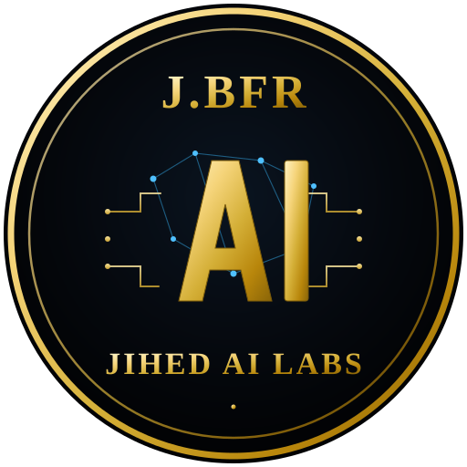

<p align="center">
  
</p>

<h1 align="center">AI Engineering Skills Library</h1>

<p align="center">
  <b>Base de connaissances opérationnelle pour l'ingénierie des systèmes IA, agents LLM, pipelines RAG et intégrations Model Context Protocol (MCP).</b>
</p>

<p align="center">
  <a href="README.md">🇬🇧 Read in English</a> •
  <a href="#-architecture--domaines">Architecture</a> •
  <a href="#-conventions">Conventions</a> •
  <a href="#-licence">Licence</a>
</p>

---

## 📌 Présentation

Ce dépôt rassemble **50 compétences d'ingénierie IA (skills)** réparties sur **10 domaines clés**. Chaque fiche suit un format hybride : des recommandations d'architecture claires pour l'humain et des patterns directement exploitables par les assistants d'ingénierie et développeurs.

Il fait le pont entre la théorie de l'IA et la réalité de la production en entreprise (économie des tokens, compromis de latence, gestion d'état, garde-fous de sécurité et intégration Spring AI).

---

## 🏗️ Architecture & Domaines

```text
ai-skills/
├── 01-llm-foundations-and-models/     # Sélection des modèles, optimisation du contexte, quantification & calculs de tokens
├── 02-prompt-and-context-engineering/# Few-shot, Chain-of-Thought, ReAct, délimiteurs XML & compression de contexte
├── 03-rag-architectures/              # Stratégies de découpage (chunking), recherche hybride (BM25 + Vectoriel), re-ranking & filtres
├── 04-agentic-workflows/              # Orchestration mono/multi-agents, boucles de supervision, human-in-the-loop & mémoire
├── 05-mcp-protocol-and-tools/         # Serveurs Model Context Protocol (MCP), transports stdio/SSE & schémas d'outils
├── 06-spring-ai-integration/          # Spring AI ChatClient, Advisors, Tool Calling `@Bean` & intégration PGVector
├── 07-vector-databases-and-embeddings/# Modèles d'embeddings, indexation HNSW, tuning PGVector & métriques de similitude
├── 08-ai-security-and-guardrails/     # Défense contre le prompt injection, masquage PII, prévention de fuite de secrets & rate limits
├── 09-evaluations-and-observability/  # Métriques RAGAS, LLM-as-a-judge, traçage OpenTelemetry & suivi de latence
└── 10-coding-agents-and-workflow/     # Flux de travail des agents de code, conformité Git-human & refactoring
```

---

## 📋 Matrice des Domaines (5 Skills par Domaine)

| Domaine | Thème Principal | Sujets Couverts |
| :--- | :--- | :--- |
| **01. LLM Foundations** | Modèles & Économie | Calculs de tokenization, dégradation du contexte, quantification (GGUF/AWQ), coûts API |
| **02. Prompt & Context Eng.** | Optimisation de Prompt | Architecture du prompt système, délimiteurs XML, ReAct, troncature de contexte |
| **03. RAG Architectures** | Recherche Avancée | Chunking sémantique, recherche hybride BM25 + Vector, re-ranking Cohere, PGVector |
| **04. Agentic Workflows** | Orchestration Multi-Agents | Persistance de graphe d'état, pattern supervisor, boucle de réflexion, outils |
| **05. MCP & Tooling** | Spécification Protocole | Serveur MCP, transport stdio/SSE, schémas d'outils JSON-Schema |
| **06. Spring AI Integration** | IA Java Entreprise | API fluide `ChatClient`, chaîne d'Advisors, Spring Data PGVector, Tool Calling `@Bean` |
| **07. Vector DB & Embeddings**| Optimisation Stockage | Compromis dimensionnels d'embeddings, indexation HNSW, Cosine vs Produit Scalaire |
| **08. AI Security** | Sécurité & Garde-Fous | Prompt injection indirect, assainissement de sortie, masquage PII, rate-limiting |
| **09. Evals & Observabilité** | Qualité & Métriques | Fidélité & Pertinence des réponses (RAGAS), spans OpenTelemetry, latence TTFT |
| **10. Coding Agents** | Productivité Développeur | Flux d'agents autonomes, hygiène des commits Git, génération de tests |

---

## 📐 Conventions & Engagements

Chaque fiche de ce dépôt respecte 4 contraintes d'ingénierie strictes :

1. **Estimation des Coûts et Latences** : Chaque technique précise son impact en consommation de tokens, sa pénalité de latence (TTFT / TBT) et sa complexité de maintenance.
2. **Versionnage des APIs** : Toutes les bibliothèques citées (Spring AI, LangChain, Anthropic SDK, OpenAI SDK) mentionnent explicitement leur version cible.
3. **Zéro Contenu Superflu** : Le catalogue est strictement plafonné à **5 skills à fort impact par domaine** afin d'assurer un niveau de pertinence maximal.
4. **Zéro Trace d'IA** : L'ensemble de la documentation adopte une voix technique naturelle et rigoureuse ancrée dans l'expérience du terrain.

---

## 📄 Licence

Distribué sous licence **MIT**. Conçu & entretenu par **Jihed Ben Arfa**.
