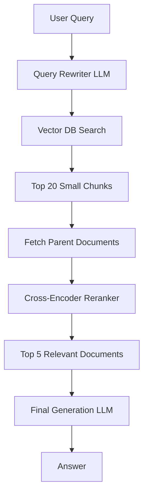

## Prerequisites
- A working naive RAG pipeline. This is what you reach for when its answers stop being good enough.
- A vector store you can re-index, since parent-child changes what gets stored.

## Usage

### Architectural Context

"Naive RAG" (chunking a PDF, embedding it, and doing a top-K search) fails in production. It loses context, retrieves irrelevant chunks, and hallucinates. To build enterprise-grade systems, architects must implement Advanced RAG patterns.

### 1. Execution Directives (Agent Instructions)

When designing a retrieval system, implement at least two of the following patterns:

#### Pattern A: Parent-Child Retrieval (Small-to-Big)
Do not feed the exact chunk you retrieved to the LLM. Embed small chunks (e.g., 200 tokens) for highly accurate search. When a chunk hits, retrieve its parent chunk (e.g., the entire 2000-token section) and feed the parent to the LLM. This provides the LLM with the surrounding context needed to understand *why* the snippet matters.

#### Pattern B: Cohere Re-Ranking (Cross-Encoding)
Vector search (Bi-Encoder) is fast but dumb; it only checks mathematical proximity. After retrieving the Top 20 chunks from Chroma/Qdrant, pass them through a Cross-Encoder (like Cohere Rerank or BGE-Reranker). The Cross-Encoder scores how well the document actually answers the specific query, and returns the reordered Top 5.

#### Pattern C: Query Transformation
Users write terrible queries (e.g., "how do I fix the error?"). Before searching the vector database, pass the user query to a fast LLM (Gemini Flash) to rewrite it into a highly semantic search query (e.g., "troubleshooting NullPointerException in Spring Boot Outbox Pattern").

### 2. Architecture Diagram (Mermaid)

## Inputs
- The current chunking strategy, and a set of questions the pipeline answers badly.

## Outputs
- A retrieval stage that returns fewer and better passages, and the latency each stage adds.
